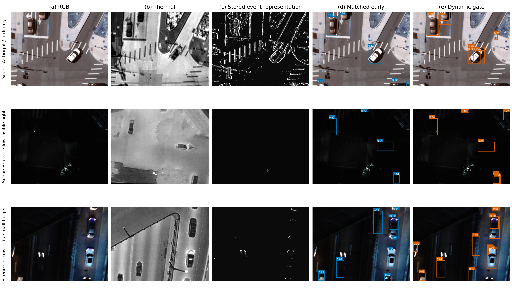

# RA-RepDet

Official code and final evidence for **RA-RepDet: Reliability-Aware RGB-Thermal-Event Fusion for Lightweight UAV Vehicle Detection under Leakage-Aware Evaluation**.

RA-RepDet adds lightweight, input-conditioned modality gating to a RepViT-FPN-FCOS detector. The routing coefficients are task-driven fusion weights; they are not calibrated sensor-health probabilities.

## Final Results

Three-seed results on the frozen component-disjoint TriAir development-validation split. Values are mean +/- sample standard deviation under standardized COCO metrics.

| Model | AP | AP50 | AP75 |
| --- | ---: | ---: | ---: |
| Matched early fusion | 0.6803 +/- 0.0221 | 0.9372 +/- 0.0047 | 0.8090 +/- 0.0251 |
| RGB + thermal early fusion | 0.6843 +/- 0.0312 | 0.9401 +/- 0.0044 | 0.8223 +/- 0.0250 |
| **RA-RepDet, no dropout** | **0.7251 +/- 0.0121** | **0.9475 +/- 0.0003** | **0.8742 +/- 0.0081** |

RA-RepDet improves AP by `0.0449 +/- 0.0341` over matched early fusion. A component-cluster bootstrap over 1,298 validation components gives a 95% percentile interval of `[0.0376, 0.0464]` for the three-seed mean component-macro AP difference.

Full ablations, single-modality results, efficiency measurements, and limitations are in [Final results](docs/RESULTS.md).

## Qualitative Result

The frozen figure below uses real TriAir validation samples and frozen seed-0 checkpoints. No image, box, confidence score, or sample choice was AI-generated or manually edited.



## Repository Contents

```text
assets/       Frozen publication figure
datasets/     TriAir five-channel dataset adapter
docs/         Results, data boundary, and reproduction guide
rarepdet/     Model, training, and evaluation code
results/      Compact machine-readable final summaries
splits/       Frozen train and development-validation manifests
tools/        Dataset and split inspection utilities
```

Raw data, labels, checkpoints, prediction caches, historical experiment queues, and private extension materials are not distributed.

## Quick Start

```bash
pip install -r requirements.txt
python tools/check_triair_dataset.py --data /path/to/triair
```

Train the primary no-dropout dynamic-gate model:

```bash
python -m rarepdet.train_early_fusion \
  --model reliability \
  --data /path/to/triair \
  --train-split splits/train.txt \
  --val-split splits/validation.txt \
  --epochs 50 --batch-size 4 --img-size 640 \
  --device cuda --lr 1e-4 --num-workers 0 \
  --modality-dropout 0.0 --seed 0 --out runs/ra_seed0
```

See [Reproduction](docs/REPRODUCIBILITY.md) for the evaluator contract, environment, split hashes, and checkpoint policy.

## Evidence Boundary

The reported partition participates in checkpoint retention and is therefore development-validation, not an independent test set. Synthetic modality removal and controlled corruption are input interventions, not physical sensor-failure experiments. The repository does not claim calibrated reliability, statistical significance, external generalization, or state-of-the-art performance.

## License

Code is released under the [Apache License 2.0](LICENSE). TriAir data rights and access terms are separate; this repository does not grant permission to redistribute the dataset.
